## Procedure

**The experiment entitled "Calibration of orifice plate" is performed into different steps which are listed below.**
1. Fan in the duct will be started.
2. Speed of the air at another end of the duct will be measured by anemometer by traversing method.
3. Pressure difference will be taken at two places by the U tube manometer as described in Figure1. The places are before orifice plate and after orifice plate.
4. Area of the duct opening will be measured from the diameter of the duct by measuring tape.
5. The quantity of the air following through the duct will be varying by changing the throttling devices which are place at the side of the duct where the fan is situated into the duct.
6. Five reading i.e. air velocity and pressure different will be taken by varying air quantity with changing the throttling device.

## Simulator Procedure

The following procedure is to be followed by the user in order to determine the coefficient of discharge of orifice plate in a duct:

Click on the button "start experiment" to start the experiment.

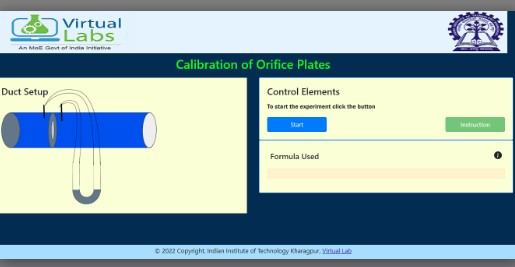

Click on the flow control device for regulating the air flow in the duct and measure the static pressure and velocity pressure.

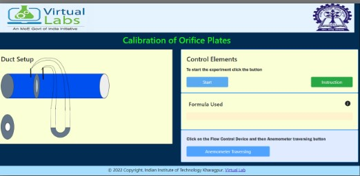

Click on the button "Anemometer Traversing" for traversing the anemometer and measure the velocity.

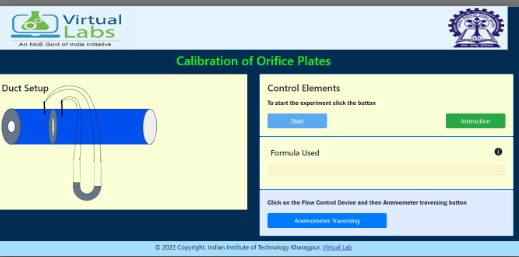

Click on the button "1st Reading" to note down the first velocity reading.

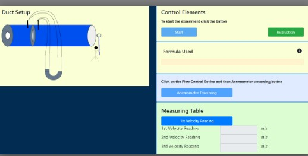

The button "3rd Reading" for 3rd measurement of air velocity. Now click on the measure button to measure the pressure difference and mean velocity.

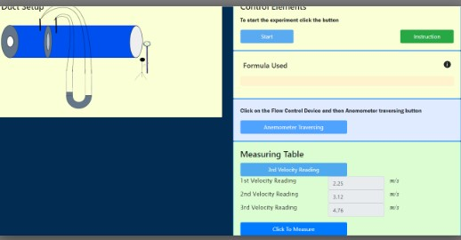

Then add result to the observation table by clicking the button "Add result to observation table".

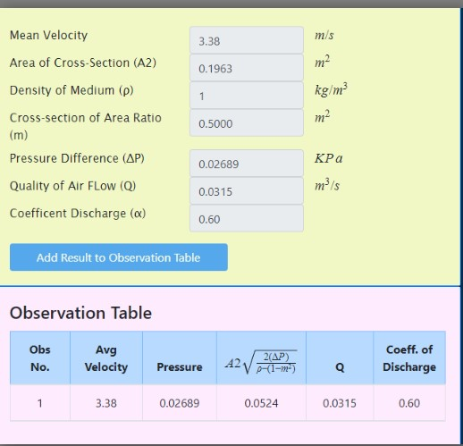

Then click on the "ok" button for regulating the air and take more measurement.

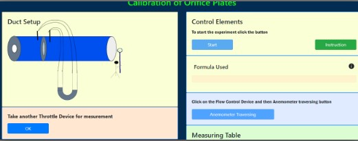

Do the same process for this flow control device also.

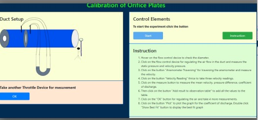

Then do the same process for 3 or 4 time, then click on the button "Ok" to plot the graph for the coefficient of discharge.

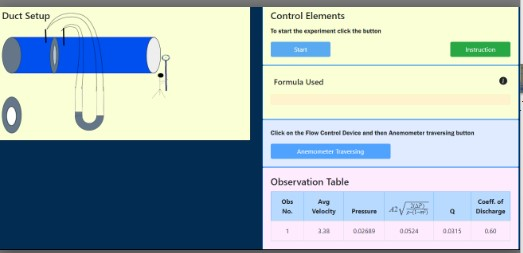

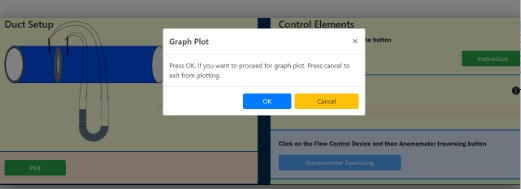

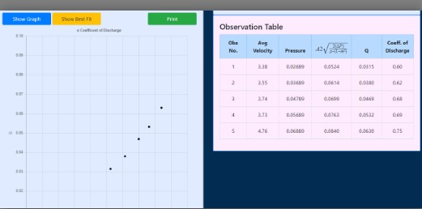

Then add Best fit line and then print the graph by clicking the print button.

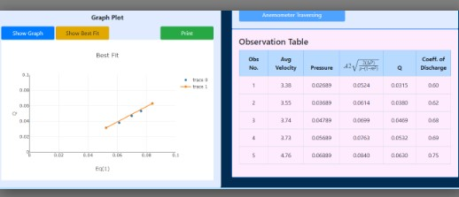

